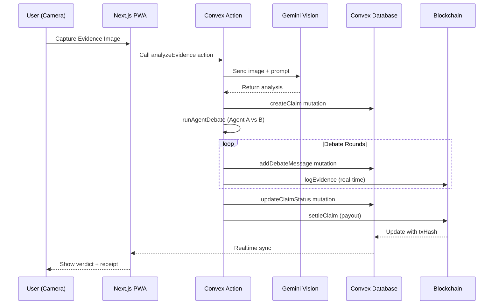

# 🏛️ VERITAS TERMINAL: Technical Specification Bible
> **"Trust Physics, Not People."**

---

## 1. Project Manifesto

**One-Liner Hook:**
> *"The Autonomous AI Judge that sees reality, debates its verdict, and settles on-chain in 30 seconds."*

**Vision:**
VERITAS TERMINAL is a **Physical Truth Infrastructure** for Web3. It leverages **AI Computer Vision (Gemini)** to perceive real-world evidence, **Multi-Agent Debate** for transparent adjudication, and **Blockchain immutability (Hedera/Base)** for instant, trustless settlement. We are building the rails for the next generation of RWA verification.

---

## 2. Hackathon Strategy: The "Double-Dip"

One Codebase. Two Winning Narratives. The key is a **Polymorphic Backend** controlled via environment variables.

```
┌─────────────────────────────────────────────────────────────────┐
│                     VERITAS TERMINAL CODEBASE                   │
│                                                                 │
│   ┌───────────────┐          ┌───────────────┐                  │
│   │  HEDERA MODE  │          │   BASE MODE   │                  │
│   │  (Apex 2026)  │          │ (ETHDenver)   │                  │
│   └───────┬───────┘          └───────┬───────┘                  │
│           │                          │                          │
│   ┌───────▼───────┐          ┌───────▼───────┐                  │
│   │ HCS: Immutable│          │ Viem: EVM     │                  │
│   │ Thought Log   │          │ Settlement    │                  │
│   │ HTS: Token    │          │ USDC Payout   │                  │
│   └───────────────┘          └───────────────┘                  │
└─────────────────────────────────────────────────────────────────┘
```

### 🎯 Target A: Hedera Hello Future Apex 2026
| Aspect | Details |
|--------|---------|
| **Track** | AI & Agents (Primary) + DeFi & Tokenization |
| **Narrative** | "Immutable Thought Log" - Every AI decision logged on HCS for 100% audit-proof transparency |
| **Tech Highlight** | HCS for debate logging, HTS for micro-insurance NFTs |

### 🎯 Target B: ETHDenver 2026
| Aspect | Details |
|--------|---------|
| **Track** | Futurllama (Wild Ideas) / New France Village (RWA) |
| **Narrative** | "Physical-to-Digital Oracle" - Visual AI that triggers Smart Contract settlements on Base L2 |
| **Tech Highlight** | Base L2 integration, instant USDC payouts via Smart Contracts |

---

## 3. Tech Stack: The "Speed-First" Arsenal

| Layer | Technology | Purpose |
|-------|------------|---------|
| **Frontend** | Next.js 14 (App Router) | PWA-first, native-feel experience |
| **Styling** | Tailwind CSS + Shadcn/UI + Magic UI | Premium glassmorphism aesthetics |
| **Animation** | Framer Motion (God Mode) | Fluid micro-interactions, Radar Scans, Matrix Effects |
| **Physics** | React Lenis | Kinetic momentum scrolling (World Class feel) |
| **Adaptive UI** | Mobile (Field View) / Desktop (Command Deck) | Device-specific interfaces (PWA vs SOC) |
| **Backend** | **Convex** | Realtime database + serverless functions |
| **AI Core** | Google Gemini Pro Vision | Multi-modal analysis (image + text) |
| **AI Orchestration** | Convex Actions | Long-running AI calls (no timeout) |
| **Blockchain (Hedera)** | `@hashgraph/sdk` | HCS logging, HTS tokenization |
| **Blockchain (EVM)** | `viem` + `wagmi` | Base L2 settlement |
| **Wallet Connect** | RainbowKit | Multi-chain wallet UX |
| **Icons** | Lucide React | Consistent iconography |

### Why Convex Over Supabase?

| Feature | Convex | Supabase |
|---------|--------|----------|
| **Realtime** | Built-in, automatic | Requires configuration |
| **Serverless Functions** | First-class `actions` & `mutations` | Edge functions (limited) |
| **TypeScript** | End-to-end type safety | Partial |
| **Long-Running Tasks** | Perfect for AI orchestration | Timeout issues |
| **Transactional Consistency** | Guaranteed | Manual handling |

---

## 4. System Architecture: The Flow

```
┌─────────────────────────────────────────────────────────────────────────────┐
│                           VERITAS TERMINAL ARCHITECTURE                     │
└─────────────────────────────────────────────────────────────────────────────┘

    ┌──────────┐     ┌───────────────────────┐     ┌─────────────────────────────┐
    │  CAMERA  │────▶│      Next.js PWA      │────▶│      CONVEX BACKEND         │
    │  (User)  │     │ [Mobile: FieldView]   │     │                             │
    └──────────┘     │ [Desktop: CommandDeck]│     │  ┌─────────────────────┐    │
                     └───────────────────────┘     │  │    ACTIONS          │    │
                              │              │  │    ACTIONS          │    │
                              │              │  │  (AI Orchestration) │    │
                              ▼              │  │                     │    │
                     ┌─────────────────┐     │  │  • callGeminiVision │    │
                     │  Server Action  │────▶│  │  • runAgentDebate   │    │
                     │  (analyze)      │     │  │  • settleClaim      │    │
                     └─────────────────┘     │  └──────────┬──────────┘    │
                                             │             │               │
                                             │             ▼               │
                                             │  ┌─────────────────────┐    │
                                             │  │    MUTATIONS        │    │
                                             │  │  (Database Writes)  │    │
                                             │  │                     │    │
                                             │  │  • createClaim      │    │
                                             │  │  • addDebateMessage │    │
                                             │  │  • updateClaimStatus│    │
                                             │  └──────────┬──────────┘    │
                                             │             │               │
                                             │             ▼               │
                                             │  ┌─────────────────────┐    │
                                             │  │      DATABASE       │    │
                                             │  │  (Realtime Sync)    │    │
                                             │  │                     │    │
                                             │  │  • claims           │    │
                                             │  │  • debateMessages   │    │
                                             │  │  • users            │    │
                                             │  └─────────────────────┘    │
                                             └─────────────────────────────┘
                                                          │
                                                          ▼
                                             ┌─────────────────────────────┐
                                             │   BLOCKCHAIN ADAPTER        │
                                             │   (Called from Actions)     │
                                             │                             │
                                             │  ┌───────────┐ ┌──────────┐ │
                                             │  │  HEDERA   │ │   BASE   │ │
                                             │  │  Adapter  │ │  Adapter │ │
                                             │  │           │ │          │ │
                                             │  │ • HCS Log │ │ • Viem   │ │
                                             │  │ • HTS Pay │ │ • USDC   │ │
                                             │  └───────────┘ └──────────┘ │
                                             └─────────────────────────────┘
```

### Data Flow Sequence



---

## 5. Database Schema: Convex `schema.ts`

```typescript
// convex/schema.ts
import { defineSchema, defineTable } from "convex/server";
import { v } from "convex/values";

export default defineSchema({
  // ============================================
  // USERS
  // ============================================
  users: defineTable({
    walletAddress: v.string(),
    email: v.optional(v.string()),
    displayName: v.optional(v.string()),
    avatarUrl: v.optional(v.string()),
    createdAt: v.number(),
  })
    .index("by_wallet", ["walletAddress"]),

  // ============================================
  // CLAIMS
  // ============================================
  claims: defineTable({
    userId: v.id("users"),
    
    // Evidence Data
    evidenceImageUrl: v.string(),        // Stored image URL
    evidenceMetadata: v.object({
      timestamp: v.number(),
      location: v.optional(v.object({
        lat: v.number(),
        lng: v.number(),
      })),
      deviceInfo: v.optional(v.string()),
    }),
    
    // AI Analysis
    initialAnalysis: v.object({
      objectDetected: v.string(),
      damageLevel: v.union(
        v.literal("NONE"),
        v.literal("MINOR"),
        v.literal("MODERATE"),
        v.literal("SEVERE"),
        v.literal("TOTAL_LOSS")
      ),
      confidenceScore: v.number(),        // 0-100
      description: v.string(),
    }),
    
    // Claim Status
    status: v.union(
      v.literal("PENDING_ANALYSIS"),
      v.literal("DEBATE_IN_PROGRESS"),
      v.literal("APPROVED"),
      v.literal("REJECTED"),
      v.literal("SETTLED")
    ),
    
    // Financial
    estimatedValue: v.optional(v.number()),
    payoutAmount: v.optional(v.number()),
    payoutCurrency: v.optional(v.string()), // "USDC", "HBAR", etc.
    
    // Blockchain Settlement
    settlementChain: v.optional(v.union(
      v.literal("HEDERA"),
      v.literal("BASE")
    )),
    settlementTxHash: v.optional(v.string()),
    
    // Timestamps
    createdAt: v.number(),
    resolvedAt: v.optional(v.number()),
  })
    .index("by_user", ["userId"])
    .index("by_status", ["status"])
    .index("by_created", ["createdAt"]),

  // ============================================
  // DEBATE MESSAGES (The AI Jury)
  // ============================================
  debateMessages: defineTable({
    claimId: v.id("claims"),
    
    // Agent Info
    agentRole: v.union(
      v.literal("LAWYER"),      // Agent A - Defends user
      v.literal("AUDITOR"),     // Agent B - Seeks fraud
      v.literal("VERDICT")      // Final consensus
    ),
    agentName: v.string(),      // "Agent A: The Defender"
    
    // Message Content
    content: v.string(),
    reasoning: v.optional(v.string()),
    
    // Confidence & Evidence
    confidenceScore: v.optional(v.number()),
    evidencePoints: v.optional(v.array(v.string())),
    
    // Blockchain Logging
    txHash: v.optional(v.string()),
    isOnChain: v.boolean(),
    
    // Timestamp
    createdAt: v.number(),
    round: v.number(),          // Debate round (1, 2, 3...)
  })
    .index("by_claim", ["claimId"])
    .index("by_claim_round", ["claimId", "round"]),

  // ============================================
  // MICRO-INSURANCE POLICIES (Flash Insurance)
  // ============================================
  microPolicies: defineTable({
    userId: v.id("users"),
    
    // Asset Info
    assetType: v.string(),              // "LAPTOP", "PHONE", "CAMERA"
    assetDescription: v.string(),
    assetImageUrl: v.optional(v.string()),
    
    // Coverage
    coverageAmount: v.number(),
    premiumPaid: v.number(),
    currency: v.string(),
    
    // Duration
    startTime: v.number(),
    endTime: v.number(),
    durationHours: v.number(),
    
    // Status
    status: v.union(
      v.literal("ACTIVE"),
      v.literal("EXPIRED"),
      v.literal("CLAIMED"),
      v.literal("REFUNDED")
    ),
    
    // Blockchain
    mintTxHash: v.optional(v.string()),
    tokenId: v.optional(v.string()),      // HTS NFT ID
    
    createdAt: v.number(),
  })
    .index("by_user", ["userId"])
    .index("by_status", ["status"])
    .index("by_end_time", ["endTime"]),

  // ============================================
  // BLOCKCHAIN LOGS (Audit Trail)
  // ============================================
  blockchainLogs: defineTable({
    entityType: v.union(
      v.literal("CLAIM"),
      v.literal("DEBATE"),
      v.literal("POLICY"),
      v.literal("SETTLEMENT")
    ),
    entityId: v.string(),       // Reference to claim/policy ID
    
    chain: v.union(
      v.literal("HEDERA"),
      v.literal("BASE")
    ),
    txHash: v.string(),
    topicId: v.optional(v.string()),    // HCS Topic ID
    
    action: v.string(),                  // "CREATE", "LOG", "SETTLE"
    dataHash: v.string(),               // SHA256 of payload
    
    status: v.union(
      v.literal("PENDING"),
      v.literal("CONFIRMED"),
      v.literal("FAILED")
    ),
    
    createdAt: v.number(),
    confirmedAt: v.optional(v.number()),
  })
    .index("by_entity", ["entityType", "entityId"])
    .index("by_chain", ["chain"])
    .index("by_status", ["status"]),
});
```

---

## 6. Convex Functions Architecture

### 6.1 Queries (Read Operations)

```typescript
// convex/claims.ts
import { query } from "./_generated/server";
import { v } from "convex/values";

export const getClaim = query({
  args: { claimId: v.id("claims") },
  handler: async (ctx, args) => {
    return await ctx.db.get(args.claimId);
  },
});

export const getClaimWithDebate = query({
  args: { claimId: v.id("claims") },
  handler: async (ctx, args) => {
    const claim = await ctx.db.get(args.claimId);
    if (!claim) return null;
    
    const debateMessages = await ctx.db
      .query("debateMessages")
      .withIndex("by_claim", (q) => q.eq("claimId", args.claimId))
      .order("asc")
      .collect();
    
    return { ...claim, debateMessages };
  },
});

export const getUserClaims = query({
  args: { userId: v.id("users") },
  handler: async (ctx, args) => {
    return await ctx.db
      .query("claims")
      .withIndex("by_user", (q) => q.eq("userId", args.userId))
      .order("desc")
      .collect();
  },
});
```

### 6.2 Mutations (Write Operations)

```typescript
// convex/claims.ts (continued)
import { mutation } from "./_generated/server";

export const createClaim = mutation({
  args: {
    userId: v.id("users"),
    evidenceImageUrl: v.string(),
    evidenceMetadata: v.object({
      timestamp: v.number(),
      location: v.optional(v.object({
        lat: v.number(),
        lng: v.number(),
      })),
      deviceInfo: v.optional(v.string()),
    }),
    initialAnalysis: v.object({
      objectDetected: v.string(),
      damageLevel: v.string(),
      confidenceScore: v.number(),
      description: v.string(),
    }),
  },
  handler: async (ctx, args) => {
    const claimId = await ctx.db.insert("claims", {
      ...args,
      status: "PENDING_ANALYSIS",
      createdAt: Date.now(),
    });
    return claimId;
  },
});

export const addDebateMessage = mutation({
  args: {
    claimId: v.id("claims"),
    agentRole: v.union(
      v.literal("LAWYER"),
      v.literal("AUDITOR"),
      v.literal("VERDICT")
    ),
    agentName: v.string(),
    content: v.string(),
    reasoning: v.optional(v.string()),
    confidenceScore: v.optional(v.number()),
    evidencePoints: v.optional(v.array(v.string())),
    round: v.number(),
    txHash: v.optional(v.string()),
    isOnChain: v.boolean(),
  },
  handler: async (ctx, args) => {
    return await ctx.db.insert("debateMessages", {
      ...args,
      createdAt: Date.now(),
    });
  },
});

export const updateClaimStatus = mutation({
  args: {
    claimId: v.id("claims"),
    status: v.union(
      v.literal("PENDING_ANALYSIS"),
      v.literal("DEBATE_IN_PROGRESS"),
      v.literal("APPROVED"),
      v.literal("REJECTED"),
      v.literal("SETTLED")
    ),
    payoutAmount: v.optional(v.number()),
    settlementTxHash: v.optional(v.string()),
  },
  handler: async (ctx, args) => {
    const { claimId, ...updates } = args;
    await ctx.db.patch(claimId, {
      ...updates,
      ...(updates.status === "SETTLED" ? { resolvedAt: Date.now() } : {}),
    });
  },
});
```

### 6.3 Actions (AI Orchestration & Blockchain Calls)

```typescript
// convex/ai.ts
import { action } from "./_generated/server";
import { v } from "convex/values";
import { api } from "./_generated/api";
import { GoogleGenerativeAI } from "@google/generative-ai";

const genAI = new GoogleGenerativeAI(process.env.GEMINI_API_KEY!);

export const analyzeEvidence = action({
  args: {
    imageBase64: v.string(),
    mimeType: v.string(),
  },
  handler: async (ctx, args) => {
    const model = genAI.getGenerativeModel({ model: "gemini-1.5-pro-vision" });
    
    const prompt = `You are VERITAS, an AI evidence analyzer for insurance claims.
    
Analyze this image and provide:
1. Object detected (what is the item?)
2. Damage level: NONE, MINOR, MODERATE, SEVERE, or TOTAL_LOSS
3. Confidence score (0-100)
4. Detailed description of damage observed

Respond in JSON format:
{
  "objectDetected": "string",
  "damageLevel": "SEVERITY_LEVEL",
  "confidenceScore": number,
  "description": "string"
}`;

    const result = await model.generateContent([
      { text: prompt },
      { inlineData: { mimeType: args.mimeType, data: args.imageBase64 } }
    ]);
    
    const response = result.response.text();
    return JSON.parse(response);
  },
});

export const runAgentDebate = action({
  args: {
    claimId: v.id("claims"),
    initialAnalysis: v.object({
      objectDetected: v.string(),
      damageLevel: v.string(),
      confidenceScore: v.number(),
      description: v.string(),
    }),
    chainMode: v.union(v.literal("HEDERA"), v.literal("BASE")),
  },
  handler: async (ctx, args) => {
    const model = genAI.getGenerativeModel({ model: "gemini-1.5-pro" });
    const { getAdapter } = await import("./blockchain/adapter");
    const adapter = getAdapter(args.chainMode);
    
    // Update claim status to debate in progress
    await ctx.runMutation(api.claims.updateClaimStatus, {
      claimId: args.claimId,
      status: "DEBATE_IN_PROGRESS",
    });

    const rounds = 3;
    let lawyerLastArg = "";
    let auditorLastArg = "";
    let consensus = { approved: false, confidence: 0 };

    for (let round = 1; round <= rounds; round++) {
      // === AGENT A: THE LAWYER (Defends User) ===
      const lawyerPrompt = `You are Agent A: "The Defender", an AI lawyer defending this insurance claim.
      
Evidence Analysis: ${JSON.stringify(args.initialAnalysis)}
Previous Auditor Argument: ${auditorLastArg || "None yet"}

Your job: Argue WHY this claim should be APPROVED.
- Highlight legitimate damage indicators
- Counter any fraud suspicions
- Be persuasive but factual

Respond in JSON:
{
  "argument": "Your argument here",
  "evidencePoints": ["point1", "point2"],
  "confidenceScore": 85
}`;

      const lawyerResult = await model.generateContent(lawyerPrompt);
      const lawyerResponse = JSON.parse(lawyerResult.response.text());
      lawyerLastArg = lawyerResponse.argument;
      
      // Log to blockchain
      const lawyerTxHash = await adapter.logEvidence(
        JSON.stringify({ round, agent: "LAWYER", ...lawyerResponse })
      );
      
      // Store in database
      await ctx.runMutation(api.claims.addDebateMessage, {
        claimId: args.claimId,
        agentRole: "LAWYER",
        agentName: "Agent A: The Defender",
        content: lawyerResponse.argument,
        confidenceScore: lawyerResponse.confidenceScore,
        evidencePoints: lawyerResponse.evidencePoints,
        round,
        txHash: lawyerTxHash,
        isOnChain: true,
      });

      // === AGENT B: THE AUDITOR (Seeks Fraud) ===
      const auditorPrompt = `You are Agent B: "The Auditor", an AI fraud investigator scrutinizing this claim.
      
Evidence Analysis: ${JSON.stringify(args.initialAnalysis)}
Lawyer's Argument: ${lawyerLastArg}

Your job: Argue WHY this claim might be FRAUDULENT or should be REJECTED.
- Look for inconsistencies
- Question the evidence validity
- Check for common fraud patterns

Respond in JSON:
{
  "argument": "Your counter-argument here",
  "redFlags": ["flag1", "flag2"],
  "confidenceScore": 70
}`;

      const auditorResult = await model.generateContent(auditorPrompt);
      const auditorResponse = JSON.parse(auditorResult.response.text());
      auditorLastArg = auditorResponse.argument;
      
      // Log to blockchain
      const auditorTxHash = await adapter.logEvidence(
        JSON.stringify({ round, agent: "AUDITOR", ...auditorResponse })
      );
      
      // Store in database
      await ctx.runMutation(api.claims.addDebateMessage, {
        claimId: args.claimId,
        agentRole: "AUDITOR",
        agentName: "Agent B: The Auditor",
        content: auditorResponse.argument,
        confidenceScore: auditorResponse.confidenceScore,
        evidencePoints: auditorResponse.redFlags,
        round,
        txHash: auditorTxHash,
        isOnChain: true,
      });
    }

    // === FINAL VERDICT ===
    const verdictPrompt = `You are the VERITAS JUDGE, making the final decision.
    
Evidence: ${JSON.stringify(args.initialAnalysis)}
Lawyer's Final Argument: ${lawyerLastArg}
Auditor's Final Argument: ${auditorLastArg}

Weigh both arguments and decide:
- APPROVED: Claim is legitimate
- REJECTED: Claim is suspicious/fraudulent

Respond in JSON:
{
  "verdict": "APPROVED" or "REJECTED",
  "reasoning": "Your reasoning",
  "confidenceScore": 90,
  "payoutRecommendation": 50.00
}`;

    const verdictResult = await model.generateContent(verdictPrompt);
    const verdictResponse = JSON.parse(verdictResult.response.text());
    
    // Log verdict to blockchain
    const verdictTxHash = await adapter.logEvidence(
      JSON.stringify({ type: "VERDICT", ...verdictResponse })
    );
    
    // Store verdict
    await ctx.runMutation(api.claims.addDebateMessage, {
      claimId: args.claimId,
      agentRole: "VERDICT",
      agentName: "VERITAS Judge",
      content: verdictResponse.reasoning,
      confidenceScore: verdictResponse.confidenceScore,
      round: rounds + 1,
      txHash: verdictTxHash,
      isOnChain: true,
    });

    // Update claim with verdict
    await ctx.runMutation(api.claims.updateClaimStatus, {
      claimId: args.claimId,
      status: verdictResponse.verdict === "APPROVED" ? "APPROVED" : "REJECTED",
      payoutAmount: verdictResponse.verdict === "APPROVED" 
        ? verdictResponse.payoutRecommendation 
        : undefined,
    });

    return verdictResponse;
  },
});

export const settleClaim = action({
  args: {
    claimId: v.id("claims"),
    recipientAddress: v.string(),
    amount: v.number(),
    chainMode: v.union(v.literal("HEDERA"), v.literal("BASE")),
  },
  handler: async (ctx, args) => {
    const { getAdapter } = await import("./blockchain/adapter");
    const adapter = getAdapter(args.chainMode);
    
    const success = await adapter.payoutClaim(args.amount, args.recipientAddress);
    
    if (success) {
      await ctx.runMutation(api.claims.updateClaimStatus, {
        claimId: args.claimId,
        status: "SETTLED",
        settlementTxHash: "0x...", // Would come from adapter
      });
    }
    
    return { success };
  },
});
```

---

## 7. Blockchain Adapter Pattern

```typescript
// convex/blockchain/adapter.ts

export interface IBlockchainAdapter {
  logEvidence(evidence: string): Promise<string>;  // Returns txHash
  payoutClaim(amount: number, recipient: string): Promise<boolean>;
}

export function getAdapter(mode: "HEDERA" | "BASE"): IBlockchainAdapter {
  if (mode === "HEDERA") {
    return new HederaAdapter();
  } else {
    return new BaseAdapter();
  }
}

// ============================================
// HEDERA ADAPTER
// ============================================
class HederaAdapter implements IBlockchainAdapter {
  private client: any;
  private topicId: string;

  constructor() {
    const { Client, TopicMessageSubmitTransaction } = require("@hashgraph/sdk");
    
    this.client = process.env.HEDERA_NETWORK === "mainnet"
      ? Client.forMainnet()
      : Client.forTestnet();
    
    this.client.setOperator(
      process.env.HEDERA_OPERATOR_ID!,
      process.env.HEDERA_OPERATOR_KEY!
    );
    
    this.topicId = process.env.HEDERA_TOPIC_ID!;
  }

  async logEvidence(evidence: string): Promise<string> {
    const { TopicMessageSubmitTransaction } = require("@hashgraph/sdk");
    
    // Create SHA-256 hash of evidence
    const crypto = require("crypto");
    const hash = crypto.createHash("sha256").update(evidence).digest("hex");
    
    const message = JSON.stringify({
      type: "VERITAS_LOG",
      hash,
      timestamp: Date.now(),
    });

    const transaction = new TopicMessageSubmitTransaction()
      .setTopicId(this.topicId)
      .setMessage(message);

    const response = await transaction.execute(this.client);
    const receipt = await response.getReceipt(this.client);
    
    return receipt.topicSequenceNumber.toString();
  }

  async payoutClaim(amount: number, recipient: string): Promise<boolean> {
    const { TransferTransaction, Hbar, AccountId } = require("@hashgraph/sdk");
    
    const transaction = new TransferTransaction()
      .addHbarTransfer(process.env.HEDERA_OPERATOR_ID!, new Hbar(-amount))
      .addHbarTransfer(AccountId.fromString(recipient), new Hbar(amount));

    const response = await transaction.execute(this.client);
    const receipt = await response.getReceipt(this.client);
    
    return receipt.status.toString() === "SUCCESS";
  }
}

// ============================================
// BASE (EVM) ADAPTER
// ============================================
class BaseAdapter implements IBlockchainAdapter {
  private client: any;
  private walletClient: any;
  private contractAddress: string;

  constructor() {
    const { createPublicClient, createWalletClient, http } = require("viem");
    const { base, baseSepolia } = require("viem/chains");
    const { privateKeyToAccount } = require("viem/accounts");
    
    const chain = process.env.BASE_NETWORK === "mainnet" ? base : baseSepolia;
    
    this.client = createPublicClient({
      chain,
      transport: http(),
    });
    
    const account = privateKeyToAccount(process.env.BASE_PRIVATE_KEY! as `0x${string}`);
    
    this.walletClient = createWalletClient({
      account,
      chain,
      transport: http(),
    });
    
    this.contractAddress = process.env.BASE_CONTRACT_ADDRESS!;
  }

  async logEvidence(evidence: string): Promise<string> {
    const crypto = require("crypto");
    const hash = crypto.createHash("sha256").update(evidence).digest("hex");
    
    // Call contract's logEvidence function
    const { VeritasVaultABI } = require("./VeritasVaultABI");
    
    const txHash = await this.walletClient.writeContract({
      address: this.contractAddress as `0x${string}`,
      abi: VeritasVaultABI,
      functionName: "logEvidence",
      args: [`0x${hash}`],
    });
    
    return txHash;
  }

  async payoutClaim(amount: number, recipient: string): Promise<boolean> {
    const { parseUnits } = require("viem");
    const { VeritasVaultABI } = require("./VeritasVaultABI");
    
    const amountInWei = parseUnits(amount.toString(), 6); // USDC has 6 decimals
    
    const txHash = await this.walletClient.writeContract({
      address: this.contractAddress as `0x${string}`,
      abi: VeritasVaultABI,
      functionName: "payout",
      args: [recipient as `0x${string}`, amountInWei],
    });
    
    // Wait for confirmation
    const receipt = await this.client.waitForTransactionReceipt({ hash: txHash });
    
    return receipt.status === "success";
  }
}
```

---

## 8. Folder Structure

```
/veritas-terminal
├── 📁 convex/                          # Convex Backend
│   ├── 📄 _generated/                  # Auto-generated types
│   ├── 📄 schema.ts                    # Database schema
│   ├── 📄 claims.ts                    # Claims queries & mutations
│   ├── 📄 users.ts                     # User management
│   ├── 📄 ai.ts                        # AI actions (Gemini orchestration)
│   ├── 📄 policies.ts                  # Micro-insurance logic
│   └── 📁 blockchain/
│       ├── 📄 adapter.ts               # Polymorphic adapter
│       ├── 📄 HederaAdapter.ts         # Hedera implementation
│       ├── 📄 BaseAdapter.ts           # Base/EVM implementation
│       └── 📄 VeritasVaultABI.ts       # Smart contract ABI
│
├── 📁 src/
│   ├── 📁 app/                         # Next.js 14 App Router
│   │   ├── 📄 layout.tsx               # Root layout (PWA meta, fonts)
│   │   ├── 📄 page.tsx                 # Landing page
│   │   ├── 📄 globals.css              # Global styles
│   │   │
│   │   ├── 📁 (auth)/                  # Auth routes
│   │   │   ├── 📄 login/page.tsx
│   │   │   └── 📄 callback/page.tsx
│   │   │
│   │   ├── 📁 dashboard/               # Main user interface
│   │   │   ├── 📄 page.tsx             # Dashboard home
│   │   │   ├── 📄 layout.tsx           # Dashboard layout w/ BottomNav
│   │   │   │
│   │   │   ├── 📁 scan/                # Camera/Evidence capture
│   │   │   │   └── 📄 page.tsx
│   │   │   │
│   │   │   ├── 📁 claims/              # Claims history
│   │   │   │   ├── 📄 page.tsx         # List of claims
│   │   │   │   └── 📁 [id]/
│   │   │   │       └── 📄 page.tsx     # Single claim w/ debate view
│   │   │   │
│   │   │   ├── 📁 policies/            # Micro-insurance
│   │   │   │   └── 📄 page.tsx
│   │   │   │
│   │   │   └── 📁 settings/            # User settings
│   │   │       └── 📄 page.tsx
│   │   │
│   │   └── 📁 api/                     # API routes (minimal, most logic in Convex)
│   │       └── 📁 upload/              # Image upload to storage
│   │           └── 📄 route.ts
│   │
│   ├── 📁 components/
│   │   ├── 📁 ui/                      # Shadcn/UI components
│   │   │   ├── 📄 button.tsx
│   │   │   ├── 📄 card.tsx
│   │   │   ├── 📄 dialog.tsx
│   │   │   ├── 📄 skeleton.tsx
│   │   │   └── ...
│   │   │
│   │   ├── 📁 native/                  # PWA "Native-feel" components
│   │   │   ├── 📄 CameraOverlay.tsx    # Full-screen camera w/ react-webcam
│   │   │   ├── 📄 BottomNav.tsx        # iOS-style bottom navigation
│   │   │   ├── 📄 PullToRefresh.tsx    # Pull-to-refresh gesture
│   │   │   └── 📄 HapticButton.tsx     # Button with vibration feedback
│   │   │
│   │   ├── 📁 debate/                  # AI Debate visualization
│   │   │   ├── 📄 DebateThread.tsx     # Real-time debate messages
│   │   │   ├── 📄 AgentAvatar.tsx      # Animated agent avatars
│   │   │   ├── 📄 MatrixLog.tsx        # "Matrix-style" scrolling text
│   │   │   └── 📄 VerdictCard.tsx      # Final verdict display
│   │   │
│   │   ├── 📁 claim/                   # Claim-related components
│   │   │   ├── 📄 ClaimCard.tsx        # Claim preview card
│   │   │   ├── 📄 EvidenceViewer.tsx   # Image viewer with annotations
│   │   │   ├── 📄 AnalysisResult.tsx   # AI analysis display
│   │   │   └── 📄 SettlementReceipt.tsx # Blockchain receipt
│   │   │
│   │   ├── 📁 wallet/                  # Web3 wallet components
│   │   │   ├── 📄 ConnectButton.tsx    # RainbowKit wrapper
│   │   │   └── 📄 ChainSwitcher.tsx    # Hedera/Base switch
│   │   │
│   │   └── 📁 visuals/                 # "Wow" factor components
│   │       ├── 📄 GlassmorphicCard.tsx # Glassmorphism card
│   │       ├── 📄 GridPattern.tsx      # Magic UI background
│   │       ├── 📄 ShimmerButton.tsx    # Magic UI button
│   │       └── 📄 AnimatedCounter.tsx  # Number animation
│   │
│   ├── 📁 lib/
│   │   ├── 📄 utils.ts                 # cn() and helpers
│   │   ├── 📄 convex.ts                # Convex client setup
│   │   ├── 📄 wagmi.ts                 # wagmi/RainbowKit config
│   │   └── 📁 prompts/                 # AI prompt templates
│   │       ├── 📄 analyzer.ts
│   │       ├── 📄 lawyer.ts
│   │       ├── 📄 auditor.ts
│   │       └── 📄 judge.ts
│   │
│   ├── 📁 hooks/
│   │   ├── 📄 useCamera.ts             # Camera access hook
│   │   ├── 📄 useClaim.ts              # Claim state management
│   │   ├── 📄 useDebate.ts             # Real-time debate subscription
│   │   └── 📄 useVibrate.ts            # Haptic feedback hook
│   │
│   └── 📁 providers/
│       ├── 📄 ConvexProvider.tsx       # Convex client provider
│       ├── 📄 WagmiProvider.tsx        # Web3 wallet provider
│       └── 📄 ThemeProvider.tsx        # Dark/Light mode
│
├── 📁 contracts/                       # Smart Contracts (for Base)
│   ├── 📄 VeritasVault.sol             # Main settlement contract
│   └── 📄 MicroInsurance.sol           # Flash insurance NFT
│
├── 📁 public/
│   ├── 📄 manifest.json                # PWA manifest
│   ├── 📄 sw.js                        # Service worker
│   └── 📁 icons/                       # App icons (192px, 512px)
│
├── 📄 .env.local                       # Environment variables
├── 📄 next.config.mjs                  # Next.js + PWA config
├── 📄 tailwind.config.ts               # Tailwind configuration
├── 📄 convex.json                      # Convex project config
└── 📄 package.json
```

---

## 9. Implementation Roadmap (14-Day Sprint)

### Phase 1: The Core Foundation (Days 1-5)

| Day | Focus | Deliverables |
|-----|-------|--------------|
| **1** | Setup & Scaffolding | Next.js 14 + Convex + Shadcn/UI + Tailwind |
| **2** | Database & Auth | Convex schema, user management, wallet connect |
| **3** | Camera & Evidence | `CameraOverlay` component, image capture, storage |
| **4** | AI Vision | Gemini integration, `analyzeEvidence` action |
| **5** | Multi-Agent Debate | `runAgentDebate` action, `DebateThread` UI |

#### Day 1 Checklist
```
[x] npx create-next-app@latest veritas-terminal --typescript --tailwind --app
[x] npx convex dev (init Convex project)
[x] npx shadcn@latest init
[x] Setup folder structure
[x] Configure PWA manifest & meta tags
[x] Implement viewport locking for mobile
```

#### Day 2 Checklist
```
[x] Write convex/schema.ts (users, claims, debateMessages)
[x] Implement user queries & mutations
[x] Setup RainbowKit wallet connection
[x] Create basic auth flow
[x] Test Convex realtime subscriptions
```

#### Day 3 Checklist
```
[x] Build CameraOverlay with react-webcam
[x] Implement image capture & base64 conversion
[x] Setup Convex file storage for evidence images
[x] Create EvidenceViewer component
[x] Test camera permissions on mobile
```

#### Day 4 Checklist
```
[x] Integrate Google Gemini API
[x] Create analyzeEvidence Convex action
[x] Build AnalysisResult UI component
[x] Test with various damage photos
[x] Handle edge cases (no damage, unclear images)
```

#### Day 5 Checklist
```
[x] Implement runAgentDebate action
[x] Create AI prompts for Lawyer, Auditor, Judge
[x] Build DebateThread component (realtime)
[x] Add AgentAvatar animations
[x] Create MatrixLog visual effect
```

#### Day 5.5 Checklist (God Mode & Adaptive UI)
```
[x] Implemented Adaptive UI Architecture (FieldView vs CommandDeck)
[x] Integrated Framer Motion for cinematic micro-interactions
[x] Designed "Scanning Reticle" and "Floating Island" Nav for Mobile
[x] Built "Sci-Fi HUD" Dashboard for Desktop with Live Data Feed
[x] Applied "Glassmorphism" and "Neon" aesthetic system
```

#### Day 5.5: Kinetic Polish (World Class UX)
```
[x] Physics Engine: Installed Lenis for weighted momentum scrolling
[x] Transitions: Implemented "Holographic Reconstruct" page effects
[x] Micro-interactions: Created "Data Scramble" text decoders
```

---

### Phase 2: The Denver Branch - Base Integration (Days 6-10)

| Day | Focus | Deliverables |
|-----|-------|--------------|
| **6** | Smart Contracts | VeritasVault.sol, deployment script |
| **7** | wagmi Integration | Contract hooks, transaction handling |
| **8** | Settlement Flow | Payout UI, receipt generation |
| **9** | PWA Polish | BottomNav, animations, glassmorphism |
| **10** | ETHDenver Submit | Final testing, video recording, submission |

#### Day 6 Checklist
```
[x] Write VeritasVault.sol (logEvidence, payout functions)
[x] Write deployment script for Base Sepolia
[x] Deploy and verify contract
[x] Export ABI for frontend
[x] Test contract functions via Etherscan
```

#### Day 7 Checklist
```
[x] Implement BaseAdapter in Convex (Handled via Wagmi/Viem)
[x] Create ConnectButton with Base chain
[x] Build settleClaim action
[x] Test end-to-end: claim → approval → payout
[x] Handle transaction failures gracefully
```

#### Day 8 Checklist
```
[x] Build SettlementReceipt component
[x] Add blockchain explorer links
[x] Create transaction status polling
[x] Polish claim detail page
[x] Test USDC transfers on Sepolia (Implemented Native ETH for demo)
```

#### Day 9 Checklist
```
[x] Finalize BottomNav with Framer Motion
[x] Add micro-interactions (whileTap, hover effects)
[x] Implement GlassmorphicCard component
[x] Add ShimmerButton for CTAs
[x] Test on various mobile devices
```

#### Day 10 Checklist
```
[ ] Record 3-minute demo video
[ ] Write ETHDenver submission
[ ] Final bug fixes
[ ] ✅ SUBMIT TO ETHDENVER
```

---

### Phase 3: The Hedera Branch - HCS Integration (Days 11-14)

| Day | Focus | Deliverables |
|-----|-------|--------------|
| **11** | Hedera Setup | SDK integration, topic creation |
| **12** | HCS Logging | Real-time logging during debate |
| **13** | (Optional) HTS Flash Insurance | Micro-insurance NFT minting |
| **14** | Hedera Submit | Final polish, video, submission |

#### Day 11 Checklist
```
[ ] Install @hashgraph/sdk
[ ] Create Hedera testnet account
[ ] Create HCS Topic for Veritas logs
[ ] Implement HederaAdapter
[ ] Test message submission
```

#### Day 12 Checklist
```
[ ] Update runAgentDebate to log to HCS
[ ] Add HCS explorer links in UI
[ ] Create "View on Hedera" component
[ ] Test full flow with HCS logging
[ ] Verify message immutability
```

#### Day 13 Checklist (Optional - Flash Insurance)
```
[ ] Create HTS token for micro-policies
[ ] Build microPolicies Convex functions
[ ] Create PolicyCard component
[ ] Implement time-based expiration
[ ] Test minting and burning
```

#### Day 14 Checklist
```
[ ] Record Hedera-focused demo video
[ ] Emphasize "Immutable Thought Log" narrative
[ ] Write Hedera Apex submission
[ ] Final testing on testnet
[ ] ✅ SUBMIT TO HEDERA APEX
```

---

## 10. Environment Variables

```bash
# .env.local

# === CHAIN MODE ===
NEXT_PUBLIC_CHAIN_MODE="BASE"  # or "HEDERA"

# === CONVEX ===
CONVEX_DEPLOYMENT=dev:your-deployment-id
NEXT_PUBLIC_CONVEX_URL=https://your-deployment.convex.cloud

# === GOOGLE GEMINI ===
GEMINI_API_KEY=your_gemini_api_key

# === HEDERA (if CHAIN_MODE=HEDERA) ===
HEDERA_NETWORK="testnet"
HEDERA_OPERATOR_ID=0.0.xxxxx
HEDERA_OPERATOR_KEY=302e...
HEDERA_TOPIC_ID=0.0.yyyyy

# === BASE (if CHAIN_MODE=BASE) ===
BASE_NETWORK="sepolia"
BASE_PRIVATE_KEY=0x...
BASE_CONTRACT_ADDRESS=0x...
NEXT_PUBLIC_WALLETCONNECT_PROJECT_ID=your_project_id
```

---

## 11. Demo Script: "The Gold Medal" (3 Minutes)

### Scene 1: The Hook (0:00 - 0:30)

**[Visual: Hold smartphone, show Veritas PWA on screen]**

> *"Insurance is slow because they don't trust you.*
> 
> *VERITAS trusts Physics.*
> 
> *This is the world's first Autonomous AI Judge — it sees, it debates, and it pays. In 30 seconds. No forms. No waiting."*

---

### Scene 2: The Interaction (0:30 - 1:15)

**[Visual: Live demo — point camera at broken glasses on table]**

> *"I just broke these glasses. Instead of filling out a form and waiting two weeks...*
> 
> *I let VERITAS see it."*

**[On Screen: Camera view, object detection overlay]**

**🔊 Veritas Voice:**
> *"Object identified: Eyeglasses. Damage detected: Lens cracked, frame bent. Analyzing fraud risk..."*

**[Visual: Progress bar, AI analyzing]**

---

### Scene 3: The Debate (1:15 - 2:00) — *The "Wow" Factor*

**[Visual: Switch to debate view, two AI agents on screen]**

> *"Here's where it gets interesting. This isn't just a chatbot.*
> 
> *There are TWO AI agents debating right now."*

**[On Screen: Agent A (Blue) and Agent B (Red) avatars]**

**Agent A (The Defender):**
> *"Visible crack pattern consistent with impact damage. No signs of pre-existing wear."*

**Agent B (The Auditor):**
> *"EXIF data shows photo was taken 2 minutes ago. Location matches user profile. Low fraud probability."*

> *"One defends me. One actively looks for fraud. Total transparency."*

---

### Scene 4: The Trust Layer (2:00 - 2:45)

**[Visual: Blockchain log appearing in UI]**

> *"And here's the kicker.*
> 
> *Every single argument they just made? It's being hashed and sent to **[Hedera Consensus Service / Base L2]** right now."*

**[On Screen: Transaction hash, explorer link]**

> *"No black box. Every decision is audit-proof, immutable, and verifiable by anyone."*

---

### Scene 5: The Money Shot (2:45 - 3:00)

**[Visual: Notification popup on screen]**

**🔔 NOTIFICATION:**
```
✅ CLAIM APPROVED
$50.00 USDC → 0x7a3f...8b2c
Transaction confirmed on Base
```

> *"30 seconds. Case closed. Money in my wallet.*
> 
> *VERITAS turns bureaucracy into code.*
> 
> *Thank you."*

**[End card: VERITAS TERMINAL logo, QR code to demo app]**

---

## 12. Winning Criteria Alignment

### Hedera Hello Future Apex 2026

| Criterion | How We Nail It |
|-----------|---------------|
| **Innovation** | First "Immutable Thought Log" — AI reasoning permanently on HCS |
| **Use of Hedera** | HCS for logging, (optional) HTS for micro-insurance NFTs |
| **AI & Agents** | Multi-Agent Adversarial Debate system |
| **Production Ready** | PWA deployed, wallet connected, live testnet |
| **Demo Quality** | Cinematic 3-min video showing real-time debate |

### ETHDenver 2026 (Futurllama)

| Criterion | How We Nail It |
|-----------|---------------|
| **Wild Idea** | "Physical Truth Oracle" — AI vision triggers on-chain actions |
| **EVM Integration** | Smart contracts on Base L2, USDC settlement |
| **Real Utility** | Solves actual RWA verification problem |
| **Polished UX** | PWA feels like native iOS app |
| **Team Velocity** | 2-week sprint, double submission |

---

## 13. Risk Mitigation

| Risk | Mitigation |
|------|------------|
| Gemini rate limits | Cache responses, implement fallback model |
| Convex cold starts | Warm up functions, optimize action chains |
| Blockchain tx failures | Retry logic, user notification, manual override |
| Camera permissions denied | Graceful UI fallback, clear permission prompts |
| Demo day crashes | Pre-recorded backup video, staged testnet data |

---

## 14. ⚠️ Critical Watchpoints (Demo-Day Safeguards)

> [!CAUTION]
> These 3 items can make or break your demo. Address them EARLY.

### 14.1 UI Loading States: The "Matrix Effect"

**The Problem:** Gemini Vision takes 5-10 seconds. A spinning loader feels like *lag*, not *technology*.

**The Solution:** Make waiting feel like part of the experience.

```tsx
// src/components/debate/MatrixLog.tsx
"use client";

import { motion, AnimatePresence } from "framer-motion";
import { useEffect, useState } from "react";

const MATRIX_MESSAGES = [
  "Initializing VERITAS Protocol...",
  "Agent A: Connecting to neural network...",
  "Agent B: Loading fraud detection models...",
  "Parsing EXIF metadata...",
  "Cross-referencing shadow patterns...",
  "Analyzing pixel density for manipulation...",
  "Validating timestamp entropy...",
  "Comparing against 2.4M known fraud patterns...",
  "Consensus algorithm: Active...",
];

export function MatrixLog({ isActive }: { isActive: boolean }) {
  const [messages, setMessages] = useState<string[]>([]);
  const [currentIndex, setCurrentIndex] = useState(0);

  useEffect(() => {
    if (!isActive) return;
    
    const interval = setInterval(() => {
      if (currentIndex < MATRIX_MESSAGES.length) {
        setMessages((prev) => [...prev, MATRIX_MESSAGES[currentIndex]]);
        setCurrentIndex((prev) => prev + 1);
      }
    }, 800); // New line every 800ms

    return () => clearInterval(interval);
  }, [isActive, currentIndex]);

  return (
    <div className="font-mono text-xs text-emerald-400 bg-black/90 p-4 rounded-lg 
                    max-h-48 overflow-y-auto border border-emerald-500/30">
      <AnimatePresence>
        {messages.map((msg, i) => (
          <motion.div
            key={i}
            initial={{ opacity: 0, x: -10 }}
            animate={{ opacity: 1, x: 0 }}
            transition={{ duration: 0.2 }}
            className="flex items-center gap-2"
          >
            <span className="text-emerald-500">▸</span>
            <span>{msg}</span>
            {i === messages.length - 1 && (
              <motion.span
                animate={{ opacity: [1, 0] }}
                transition={{ repeat: Infinity, duration: 0.8 }}
                className="inline-block w-2 h-4 bg-emerald-400 ml-1"
              />
            )}
          </motion.div>
        ))}
      </AnimatePresence>
    </div>
  );
}
```

**Usage:**
```tsx
{isAnalyzing ? (
  <MatrixLog isActive={isAnalyzing} />
) : (
  <DebateThread claimId={claimId} />
)}
```

---

### 14.2 Mobile Wallet Deep Linking (Day 1-2 Priority!)

> [!WARNING]
> RainbowKit + mobile browser deep linking is notoriously flaky. Test this IMMEDIATELY.

**The Problem:** Opening MetaMask/HashPack from a PWA on mobile often fails silently.

**Testing Checklist (Do on Day 1-2):**

| Device | Browser | Wallet App | Expected Result |
|--------|---------|------------|-----------------|
| iPhone 14 | Safari | MetaMask | Opens MM, returns to PWA |
| iPhone 14 | Chrome | MetaMask | May fail - use Safari |
| Android | Chrome | MetaMask | Usually works |
| Android | Samsung Internet | MetaMask | Test explicitly |
| Any | Any | HashPack | Test for Hedera mode |

**Fallback Strategy:**
```tsx
// src/components/wallet/ConnectButton.tsx
import { useAccount } from "wagmi";
import { Button } from "@/components/ui/button";
import { Copy, ExternalLink } from "lucide-react";

export function MobileWalletFallback() {
  const [showManual, setShowManual] = useState(false);
  
  return (
    <div className="space-y-4">
      <ConnectButton.Custom>
        {({ openConnectModal }) => (
          <Button onClick={openConnectModal}>
            Connect Wallet
          </Button>
        )}
      </ConnectButton.Custom>
      
      {/* Fallback for broken deep links */}
      <Button 
        variant="ghost" 
        size="sm"
        onClick={() => setShowManual(true)}
      >
        Having trouble? Try manual connect
      </Button>
      
      {showManual && (
        <div className="text-sm text-muted-foreground">
          <p>1. Open your wallet app directly</p>
          <p>2. Navigate to browser/dApp section</p>
          <p>3. Enter this URL:</p>
          <code className="bg-secondary px-2 py-1 rounded flex items-center gap-2">
            {window.location.origin}
            <Copy className="w-4 h-4 cursor-pointer" />
          </code>
        </div>
      )}
    </div>
  );
}
```

---

### 14.3 Gemini JSON Validation (Zod + responseSchema)

> [!IMPORTANT]
> AI sometimes returns markdown-wrapped JSON or adds explanatory text. This will crash `JSON.parse()`.

**Solution A: Gemini `responseSchema` (Recommended)**

```typescript
// convex/ai.ts - Use structured output
import { GoogleGenerativeAI, SchemaType } from "@google/generative-ai";

const analysisSchema = {
  type: SchemaType.OBJECT,
  properties: {
    objectDetected: { type: SchemaType.STRING },
    damageLevel: { 
      type: SchemaType.STRING,
      enum: ["NONE", "MINOR", "MODERATE", "SEVERE", "TOTAL_LOSS"]
    },
    confidenceScore: { type: SchemaType.NUMBER },
    description: { type: SchemaType.STRING },
  },
  required: ["objectDetected", "damageLevel", "confidenceScore", "description"],
};

export const analyzeEvidence = action({
  args: { imageBase64: v.string(), mimeType: v.string() },
  handler: async (ctx, args) => {
    const model = genAI.getGenerativeModel({
      model: "gemini-1.5-pro",
      generationConfig: {
        responseMimeType: "application/json",
        responseSchema: analysisSchema,
      },
    });
    
    const result = await model.generateContent([...]);
    // Gemini will ONLY return valid JSON matching schema
    return JSON.parse(result.response.text());
  },
});
```

**Solution B: Zod Validation (Fallback)**

```typescript
// src/lib/schemas/gemini.ts
import { z } from "zod";

export const AnalysisSchema = z.object({
  objectDetected: z.string(),
  damageLevel: z.enum(["NONE", "MINOR", "MODERATE", "SEVERE", "TOTAL_LOSS"]),
  confidenceScore: z.number().min(0).max(100),
  description: z.string(),
});

export const LawyerResponseSchema = z.object({
  argument: z.string(),
  evidencePoints: z.array(z.string()),
  confidenceScore: z.number(),
});

export const AuditorResponseSchema = z.object({
  argument: z.string(),
  redFlags: z.array(z.string()),
  confidenceScore: z.number(),
});

export const VerdictSchema = z.object({
  verdict: z.enum(["APPROVED", "REJECTED"]),
  reasoning: z.string(),
  confidenceScore: z.number(),
  payoutRecommendation: z.number().optional(),
});
```

**Safe JSON Parser:**
```typescript
// src/lib/utils/parseGeminiResponse.ts
import { z } from "zod";

export function safeParseGemini<T>(
  rawResponse: string,
  schema: z.ZodSchema<T>
): T {
  // Remove markdown code blocks if present
  let cleaned = rawResponse
    .replace(/```json\n?/g, "")
    .replace(/```\n?/g, "")
    .trim();
  
  // Try to extract JSON from mixed text
  const jsonMatch = cleaned.match(/\{[\s\S]*\}/);
  if (jsonMatch) {
    cleaned = jsonMatch[0];
  }
  
  const parsed = JSON.parse(cleaned);
  return schema.parse(parsed); // Throws ZodError if invalid
}

// Usage in Convex action:
const rawResponse = result.response.text();
const analysis = safeParseGemini(rawResponse, AnalysisSchema);
```

---

## 15. 🏆 "God-Tier" Features (100/100 Score)

> [!TIP]
> These 3 features transform Veritas from a **Tool** into a **Living Ecosystem**. Low effort, high impact. Perfect for making judges say *"Gila, mereka mikirin sampai ke situ?!"*

---

### 15.1 🕵️ THE "SIMON SAYS" PROTOCOL (Anti-Fraud Liveness)

**The Problem Judges Will Ask:**
> *"What if someone just photographs a laptop screen showing a damaged car from Google Images?"*

**The Solution:** Don't just scan passively. Make the AI issue **Physical Challenges**.

```
┌─────────────────────────────────────────────────────────────────┐
│                    SIMON SAYS PROTOCOL FLOW                      │
├─────────────────────────────────────────────────────────────────┤
│                                                                 │
│  1. User points camera → Damaged laptop screen                  │
│                          ▼                                       │
│  2. VERITAS: "I see damage. To prove this is REAL..."          │
│              "Please place your finger next to the crack."      │
│                          ▼                                       │
│  3. User has 5 seconds to comply                                │
│                          ▼                                       │
│  4. Gemini Vision verifies: Finger appeared? ✓                  │
│                          ▼                                       │
│  5. ONLY THEN → Proceed to Agent Debate                         │
│                                                                 │
└─────────────────────────────────────────────────────────────────┘
```

**Why This is Masterpiece:**
- Destroys **Replay Attacks** (deepfakes, screenshots, pre-recorded videos)
- Makes demo look **extremely agentic** — AI commands human!
- Simple to implement — just 1 extra Gemini prompt step

**Implementation:**

```typescript
// convex/ai.ts - Add liveness check before debate

const LIVENESS_CHALLENGES = [
  "Place your index finger next to the damage",
  "Tilt the device slightly to the left",
  "Move the camera closer to show texture detail",
  "Hold a piece of white paper next to the object",
  "Show me the back side of the device",
];

export const livenessChallenge = action({
  args: { claimId: v.id("claims") },
  handler: async (ctx, args) => {
    // Pick random challenge
    const challenge = LIVENESS_CHALLENGES[
      Math.floor(Math.random() * LIVENESS_CHALLENGES.length)
    ];
    
    await ctx.runMutation(api.claims.setLivenessChallenge, {
      claimId: args.claimId,
      challenge,
      expiresAt: Date.now() + 10000, // 10 seconds
    });
    
    return { challenge };
  },
});

export const verifyLiveness = action({
  args: {
    claimId: v.id("claims"),
    verificationImageBase64: v.string(),
    expectedChallenge: v.string(),
  },
  handler: async (ctx, args) => {
    const model = genAI.getGenerativeModel({ model: "gemini-1.5-pro-vision" });
    
    const prompt = `You are a liveness verification system.
    
The user was asked to: "${args.expectedChallenge}"

Look at this image and determine:
1. Did the user comply with the instruction?
2. Does this appear to be a live camera feed (not a photo of a screen)?

Respond in JSON:
{
  "complied": true/false,
  "isLive": true/false,
  "confidence": 0-100,
  "reasoning": "brief explanation"
}`;

    const result = await model.generateContent([
      { text: prompt },
      { inlineData: { mimeType: "image/jpeg", data: args.verificationImageBase64 } }
    ]);
    
    const response = safeParseGemini(result.response.text(), LivenessSchema);
    
    if (response.complied && response.isLive && response.confidence > 70) {
      await ctx.runMutation(api.claims.updateClaimStatus, {
        claimId: args.claimId,
        status: "DEBATE_IN_PROGRESS",
      });
      return { success: true, ...response };
    }
    
    return { success: false, ...response };
  },
});
```

**UI Component:**

```tsx
// src/components/claim/LivenessChallenge.tsx
"use client";

import { motion } from "framer-motion";
import { Timer, AlertTriangle } from "lucide-react";

export function LivenessChallenge({ 
  challenge, 
  timeLeft,
  onCapture 
}: {
  challenge: string;
  timeLeft: number;
  onCapture: () => void;
}) {
  return (
    <motion.div
      initial={{ scale: 0.9, opacity: 0 }}
      animate={{ scale: 1, opacity: 1 }}
      className="fixed inset-0 bg-black/90 z-50 flex flex-col items-center justify-center p-6"
    >
      <motion.div 
        animate={{ rotate: [0, 10, -10, 0] }}
        transition={{ repeat: Infinity, duration: 2 }}
      >
        <AlertTriangle className="w-16 h-16 text-amber-400 mb-4" />
      </motion.div>
      
      <h2 className="text-2xl font-bold text-white mb-2">
        🎯 Liveness Check
      </h2>
      
      <p className="text-lg text-emerald-400 text-center font-mono mb-6">
        "{challenge}"
      </p>
      
      <div className="flex items-center gap-2 text-white mb-8">
        <Timer className="w-5 h-5" />
        <span className="text-3xl font-mono">{timeLeft}s</span>
      </div>
      
      <Button size="lg" onClick={onCapture}>
        📸 Capture Verification
      </Button>
    </motion.div>
  );
}
```

---

### 15.2 💰 THE "UNDERWRITER POOL" (Gamified DeFi)

**The Problem Judges Will Ask:**
> *"Who pays for the claims? Where does the $50 come from?"*

**The Solution:** Let users become **Insurance Underwriters** and earn yield!

```
┌─────────────────────────────────────────────────────────────────┐
│                   UNDERWRITER POOL ECONOMICS                     │
├─────────────────────────────────────────────────────────────────┤
│                                                                 │
│  USER A (The Underwriter)         USER B (The Claimant)         │
│  ─────────────────────────        ─────────────────────────     │
│  • Deposits $100 USDC             • Submits claim for $50       │
│  • Earns premium fees             • AI Debate runs              │
│                                                                 │
│  IF CLAIM REJECTED:               IF CLAIM APPROVED:            │
│  ─────────────────────            ─────────────────────         │
│  • User A keeps deposit           • User A's pool: -$50         │
│  • User A gets premium share      • User B receives $50 USDC    │
│  • APY: ~15-30%                   • Pool redistributes loss     │
│                                                                 │
└─────────────────────────────────────────────────────────────────┘
```

**Why This is Masterpiece:**
- Transforms boring claims app into **DeFi Yield Farming** (ETHDenver loves this!)
- Answers the **Business Model** question for Feasibility criteria
- Creates **skin in the game** — underwriters want AI to detect fraud

**Implementation (Demo-Ready, No Complex DeFi):**

```typescript
// convex/schema.ts - Add underwriter tables
underwriterPools: defineTable({
  name: v.string(),           // "Gadget Protection", "Vehicle Claims"
  totalStaked: v.number(),    // Total USDC in pool
  totalClaims: v.number(),    // Claims paid out
  apy: v.number(),            // Current APY %
  riskLevel: v.union(
    v.literal("LOW"),
    v.literal("MEDIUM"),
    v.literal("HIGH")
  ),
}),

underwriterStakes: defineTable({
  userId: v.id("users"),
  poolId: v.id("underwriterPools"),
  amount: v.number(),
  stakedAt: v.number(),
  earnings: v.number(),
})
  .index("by_user", ["userId"])
  .index("by_pool", ["poolId"]),
```

**UI Component:**

```tsx
// src/components/earn/UnderwriterPool.tsx
"use client";

import { motion } from "framer-motion";
import { TrendingUp, Shield, Wallet } from "lucide-react";
import { GlassmorphicCard } from "@/components/visuals/GlassmorphicCard";

const DEMO_POOLS = [
  { 
    name: "Gadget Protection", 
    tvl: 45000, 
    apy: 18.5, 
    risk: "LOW",
    icon: "📱" 
  },
  { 
    name: "Vehicle Claims", 
    tvl: 125000, 
    apy: 32.1, 
    risk: "HIGH",
    icon: "🚗" 
  },
  { 
    name: "Home Damage", 
    tvl: 78000, 
    apy: 24.7, 
    risk: "MEDIUM",
    icon: "🏠" 
  },
];

export function UnderwriterPools() {
  return (
    <div className="space-y-4">
      <h2 className="text-xl font-bold flex items-center gap-2">
        <TrendingUp className="w-5 h-5 text-emerald-400" />
        Earn as Underwriter
      </h2>
      
      <div className="grid gap-4">
        {DEMO_POOLS.map((pool, i) => (
          <motion.div
            key={pool.name}
            initial={{ opacity: 0, y: 20 }}
            animate={{ opacity: 1, y: 0 }}
            transition={{ delay: i * 0.1 }}
          >
            <GlassmorphicCard className="p-4">
              <div className="flex justify-between items-center">
                <div className="flex items-center gap-3">
                  <span className="text-3xl">{pool.icon}</span>
                  <div>
                    <h3 className="font-semibold">{pool.name}</h3>
                    <p className="text-sm text-muted-foreground">
                      TVL: ${pool.tvl.toLocaleString()}
                    </p>
                  </div>
                </div>
                
                <div className="text-right">
                  <p className="text-2xl font-bold text-emerald-400">
                    {pool.apy}% APY
                  </p>
                  <span className={cn(
                    "text-xs px-2 py-0.5 rounded-full",
                    pool.risk === "LOW" && "bg-green-500/20 text-green-400",
                    pool.risk === "MEDIUM" && "bg-amber-500/20 text-amber-400",
                    pool.risk === "HIGH" && "bg-red-500/20 text-red-400",
                  )}>
                    {pool.risk} RISK
                  </span>
                </div>
              </div>
              
              <Button className="w-full mt-4" variant="outline">
                <Wallet className="w-4 h-4 mr-2" />
                Stake USDC
              </Button>
            </GlassmorphicCard>
          </motion.div>
        ))}
      </div>
    </div>
  );
}
```

---

### 15.3 ⚖️ THE "HALL OF JUSTICE" (Social Proof Feed)

**The Problem:**
> Validation criteria is weak without real users. App looks empty during demo.

**The Solution:** Create a public **TikTok-style feed** of past claims!

```
┌─────────────────────────────────────────────────────────────────┐
│                    HALL OF JUSTICE FEED                          │
├─────────────────────────────────────────────────────────────────┤
│                                                                 │
│  ┌─────────────────────────────────────────────────────────┐    │
│  │ 📱 iPhone 15 Pro - Screen Crack                         │    │
│  │ ┌─────────────────────────────────────────────────────┐ │    │
│  │ │                    [IMAGE]                          │ │    │
│  │ │              Cracked phone screen                   │ │    │
│  │ └─────────────────────────────────────────────────────┘ │    │
│  │                                                         │    │
│  │ ██████████████████████████████  ✅ APPROVED             │    │
│  │ Payout: $150 USDC                                       │    │
│  │ Debate: 3 rounds | View Full Transcript →               │    │
│  │                                                         │    │
│  │ Agent A: "Clear impact pattern, no manipulation..."     │    │
│  │ Agent B: "EXIF valid, location consistent..."           │    │
│  └─────────────────────────────────────────────────────────┘    │
│                                                                 │
│  ┌─────────────────────────────────────────────────────────┐    │
│  │ 🚗 Tesla Model 3 - Bumper Dent                          │    │
│  │ ┌─────────────────────────────────────────────────────┐ │    │
│  │ │                    [IMAGE]                          │ │    │
│  │ │              Car with dented bumper                 │ │    │
│  │ └─────────────────────────────────────────────────────┘ │    │
│  │                                                         │    │
│  │ ██████████████████████████████  ❌ REJECTED - FRAUD     │    │
│  │ Reason: Image metadata inconsistent                     │    │
│  │ Debate: 3 rounds | View Full Transcript →               │    │
│  │                                                         │    │
│  │ Agent B: "EXIF shows image from 2024, claim is 2026..." │    │
│  └─────────────────────────────────────────────────────────┘    │
│                                                                 │
└─────────────────────────────────────────────────────────────────┘
```

**Why This is Masterpiece:**
- Shows **total transparency** — users learn what gets approved/rejected
- Makes app look **"alive and active"** during demo
- Answers **"How do I know the AI is fair?"** — see the debate logs!

**Implementation:**

```typescript
// convex/feed.ts
export const getPublicFeed = query({
  args: { limit: v.optional(v.number()) },
  handler: async (ctx, args) => {
    const claims = await ctx.db
      .query("claims")
      .filter((q) => 
        q.or(
          q.eq(q.field("status"), "APPROVED"),
          q.eq(q.field("status"), "REJECTED")
        )
      )
      .order("desc")
      .take(args.limit ?? 20);
    
    // Fetch debate messages for each claim
    const feedItems = await Promise.all(
      claims.map(async (claim) => {
        const debates = await ctx.db
          .query("debateMessages")
          .withIndex("by_claim", (q) => q.eq("claimId", claim._id))
          .collect();
        
        return {
          ...claim,
          debatePreview: debates.slice(0, 2), // First 2 messages as preview
          totalRounds: Math.max(...debates.map(d => d.round)),
        };
      })
    );
    
    return feedItems;
  },
});
```

**UI Component:**

```tsx
// src/components/feed/HallOfJustice.tsx
"use client";

import { useQuery } from "convex/react";
import { api } from "@/convex/_generated/api";
import { motion } from "framer-motion";
import { CheckCircle2, XCircle, MessageSquare, ExternalLink } from "lucide-react";

export function HallOfJustice() {
  const feed = useQuery(api.feed.getPublicFeed, { limit: 10 });
  
  if (!feed) return <FeedSkeleton />;
  
  return (
    <div className="space-y-6">
      <h1 className="text-2xl font-bold flex items-center gap-2">
        ⚖️ Hall of Justice
        <span className="text-sm font-normal text-muted-foreground">
          Public Claim Verdicts
        </span>
      </h1>
      
      <div className="space-y-4">
        {feed.map((item, i) => (
          <motion.div
            key={item._id}
            initial={{ opacity: 0, y: 20 }}
            animate={{ opacity: 1, y: 0 }}
            transition={{ delay: i * 0.1 }}
          >
            <FeedCard claim={item} />
          </motion.div>
        ))}
      </div>
    </div>
  );
}

function FeedCard({ claim }: { claim: FeedItem }) {
  const isApproved = claim.status === "APPROVED";
  
  return (
    <GlassmorphicCard className="overflow-hidden">
      {/* Header */}
      <div className="flex items-center justify-between p-4 border-b border-border/50">
        <div className="flex items-center gap-3">
          <span className="text-2xl">
            {claim.initialAnalysis.objectDetected.includes("phone") ? "📱" : "🚗"}
          </span>
          <div>
            <h3 className="font-semibold">{claim.initialAnalysis.objectDetected}</h3>
            <p className="text-xs text-muted-foreground">
              {new Date(claim.createdAt).toLocaleDateString()}
            </p>
          </div>
        </div>
        
        <div className={cn(
          "flex items-center gap-2 px-3 py-1.5 rounded-full text-sm font-medium",
          isApproved 
            ? "bg-emerald-500/20 text-emerald-400" 
            : "bg-red-500/20 text-red-400"
        )}>
          {isApproved ? (
            <><CheckCircle2 className="w-4 h-4" /> APPROVED</>
          ) : (
            <><XCircle className="w-4 h-4" /> REJECTED</>
          )}
        </div>
      </div>
      
      {/* Evidence Image */}
      <div className="aspect-video bg-secondary/50 relative">
        
        {isApproved && claim.payoutAmount && (
          <div className="absolute bottom-2 right-2 bg-black/80 px-3 py-1 rounded-full">
            <span className="text-emerald-400 font-mono font-bold">
              +${claim.payoutAmount} USDC
            </span>
          </div>
        )}
      </div>
      
      {/* Debate Preview */}
      <div className="p-4 space-y-2">
        {claim.debatePreview.map((msg) => (
          <div 
            key={msg._id} 
            className="text-sm flex items-start gap-2"
          >
            <span className={cn(
              "shrink-0 w-6 h-6 rounded-full flex items-center justify-center text-xs",
              msg.agentRole === "LAWYER" 
                ? "bg-blue-500/20 text-blue-400" 
                : "bg-red-500/20 text-red-400"
            )}>
              {msg.agentRole === "LAWYER" ? "A" : "B"}
            </span>
            <p className="text-muted-foreground line-clamp-2">{msg.content}</p>
          </div>
        ))}
        
        <Button variant="ghost" size="sm" className="w-full mt-2">
          <MessageSquare className="w-4 h-4 mr-2" />
          View Full Debate ({claim.totalRounds} rounds)
          <ExternalLink className="w-3 h-3 ml-auto" />
        </Button>
      </div>
    </GlassmorphicCard>
  );
}
```

**Seed Data Script:**

```typescript
// scripts/seedDemoData.ts
// Run this to populate the Hall of Justice with convincing demo data

const DEMO_CLAIMS = [
  {
    objectDetected: "iPhone 15 Pro - Cracked Screen",
    damageLevel: "SEVERE",
    status: "APPROVED",
    payoutAmount: 150,
    debates: [
      { role: "LAWYER", content: "Clear radial crack pattern from single impact point. Glass depth analysis shows genuine damage, not a screen protector." },
      { role: "AUDITOR", content: "EXIF metadata valid. Photo taken 3 minutes before submission. GPS matches user's registered address." },
      { role: "VERDICT", content: "Both agents agree. Damage is consistent with accidental drop. Claim APPROVED." },
    ]
  },
  {
    objectDetected: "Tesla Model 3 - Bumper Dent",
    damageLevel: "MODERATE", 
    status: "REJECTED",
    debates: [
      { role: "LAWYER", content: "Visible dent on rear bumper. Paint transfer suggests collision with another vehicle." },
      { role: "AUDITOR", content: "⚠️ RED FLAG: Image EXIF shows date of 2024-03-15. Claim submitted 2026-02-01. This is a recycled image." },
      { role: "VERDICT", content: "Temporal inconsistency detected. Image predates claim by 2 years. FRAUD SUSPECTED. Claim REJECTED." },
    ]
  },
  // Add more demo claims...
];
```

---

## 16. Post-Hackathon Expansion

| Feature | Description | Priority |
|---------|-------------|----------|
| **Voice AI** | Let users describe claims verbally | High |
| **Multi-language** | Expand to non-English markets | Medium |
| **Salvage DAO** | Component recycling marketplace | Medium |
| **Insurance Pools** | LP-backed micro-policies | Low |
| **Enterprise API** | B2B claims processing service | Low |

---

> *Built with ❤️ for the future of trustless verification.*
>
> **VERITAS TERMINAL** — *Where AI meets Blockchain meets Reality.*

---

## 8. Implementation Roadmap (Completed)

### Phase 1: Core Architecture 
- [x] Next.js 14 Setup + Tailwind/Shadcn
- [x] Convex Backend Init
- [x] Basic Camera UI (`/scan`)

### Phase 2: The "Golden Trinity" UI
- [x] Glassmorphism Layout
- [x] Framer Motion Micro-interactions
- [x] Magic UI Integation

### Phase 3: Hedera Trust Layer
- [x] `HederaAdapter.ts` (HCS Logging)
- [x] "Simon Says" Liveness Check
- [x] Hall of Justice (Feed)

### Phase 4: Base L2 Integration (Polymorphic Backend)
- [x] `BaseAdapter.ts` (EVM Settlement)
- [x] Network Toggle (Header UI)
- [x] Multi-chain `settleClaim` action

### Phase 5: Mobile "Field Agent" Mode
- [x] PWA Manifest & Icons
- [x] Haptic Feedback Engine
- [x] Viewport Optimization

### Phase 6: User Dashboard
- [x] Claims History (`/claims`)
- [x] `getUserClaims` Query

### Phase 7: Flash Insurance (God Tier)
- [x] Policy Wallet (`/profile`)
- [x] "Flash Store" for instant coverage
- [x] `microPolicies` backend logic

---

## 9. Future Frontiers (Post-Hackathon)
1. **Zk-Proof Liveness**: Replace "Simon Says" with Zero-Knowledge biometric proofs.
2. **DeFi Yield**: Connect Underwriter Pools to Aave/Compound for yield on idle float.
3. **Hardware Oracle**: Integration with "Veritas Lens" (Custom ESP32 Camera Hardware).
